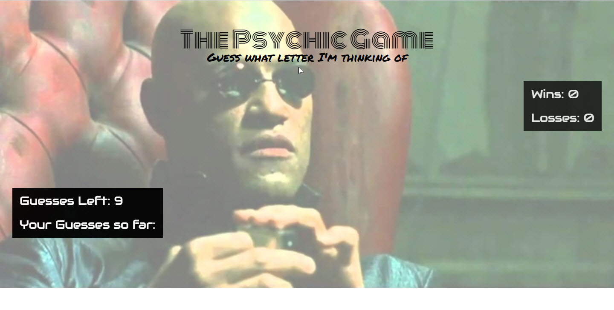
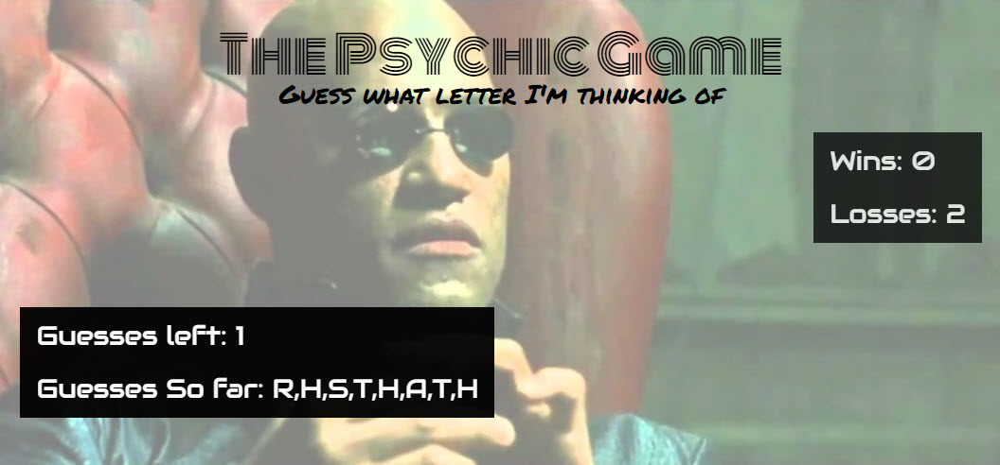

# Psychic-Game
-This is a simple user vs. computer game 
-User has 9 chances to guess a letter matching the computer's randomly selected letter
-There is *no strategy*, all computer choices are randomly generated

Counters displayed include:
  - User wins 
  - User losses
  - Number of guesses remaining
  - What letters have been guessed during a round of play (resets every win/loss)

Utilized: 
  - onkeyup _event_
  - if, else if, else _conditional statements_
  - push() _method_
  - document.getElementById() _method_
  - textContent _property_  

  
  
 Link to deployed project:
  https://kellikells.github.io/Psychic-Game/
 
 
